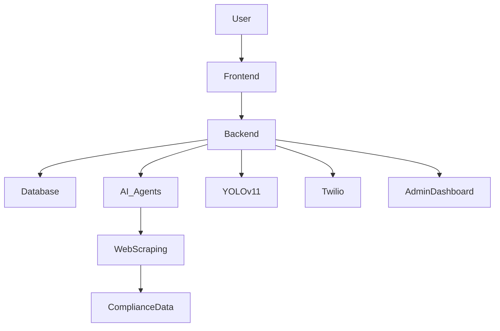
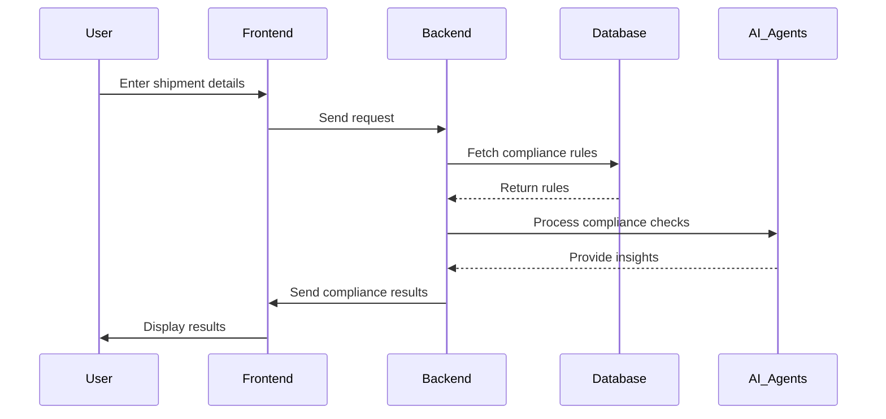

# 🚀 Rapid Compliance Checker

## 🌍 Revolutionizing Cross-Border Compliance

**Imagine a world where international shipments are seamless, with zero compliance guesswork.** Our **AI-powered Rapid Compliance Checker** automates and simplifies compliance checks, ensuring accuracy, efficiency, and regulatory adherence. 

---

## 🔥 Key Features

### ✅ **Real-Time Compliance Knowledge Base**
- **Data Sources**: Government portals, FedEx, UPS, and international regulatory sources.
- **Graph RAG Model**: AI-driven retrieval for country-specific compliance rules.
- **Interactive Chatbot**: Memory-enabled compliance queries.

### 🛑 **AI-Powered Prohibited Item Checker**
- **Country-Wise Checks**: Enter a country, view restricted items.
- **Item-Based Search**: Enter an item, see which countries ban it.
- **Export Options**: PDF, CSV, WhatsApp & SMS sharing.

### 📷 **Image-Based Compliance Analysis**
- **Upload Images**: YOLOv11 OBB model detects items with **99.2% accuracy**.
- **Instant Compliance Reports**: Dynamic country-wise ban lists.
- **Graphical Insights**: Shareable visual reports.

### 📂 **Bulk Shipment Compliance & Admin Panel**
- **CSV Upload**: Bulk compliance analysis.
- **Admin Controls**: Dynamic rule updates.
- **Parallel Processing**: Microservices architecture.

### 🤖 **AI Agents & Automated Reports**
- **Real-Time Data Scraping**: 22+ FedEx rules auto-checked.
- **Reinforcement Learning**: Self-improving compliance insights.
- **Automated Emails**: AI-generated compliance reports.

### 🌎 **Multilingual Support & Accessibility**
- **Supports French, Spanish, Chinese, Hindi, etc.**
- **WhatsApp, SMS, and Email Integration**.
- **Web & Mobile Support**.

---

## 🏗️ Tech Stack

| Component          | Technology  |
|-------------------|------------|
| **Backend**       | Flask      |
| **Database**      | MongoDB    |
| **Frontend**      | React (Vue.js) |
| **Mobile App**    | React Native |
| **Microservices** | CrewAI, Web Scraping Agents |
| **Image Recognition** | YOLOv11 OBB |
| **Messaging**     | Twilio |
| **Deployment**    | Cloud-hosted |

---

## 🚀 System Architecture



---

## 📦 Installation Guide

### 🔹 **Clone Repository**
```sh
git clone https://github.com/your-repo/rapid-compliance-checker.git
cd rapid-compliance-checker
```

### 🔹 **Backend Setup**
```sh
cd backend
python3 -m venv venv
source venv/bin/activate  # On Windows use: venv\Scripts\activate
pip install -r requirements.txt
python app.py
```

### 🔹 **Frontend Setup**
```sh
cd frontend
npm install
npm run dev
```

### 🔹 **Mobile App Setup**
```sh
cd mobile
npm install
npm run android  # or npm run ios
```

---

## 📊 Compliance Workflow



---

## 📈 Performance & Scalability
- **Microservices for Parallel Processing**.
- **Dynamic Scaling for High Loads**.
- **Automated Overnight Model Training**.

---

## 🤝 Contribution Guidelines
We welcome contributions! Follow these steps:
1. Fork the repo.
2. Create a new branch: `git checkout -b feature-branch`
3. Commit changes: `git commit -m 'Add feature'`
4. Push to branch: `git push origin feature-branch`
5. Open a Pull Request.

---

## 📜 License
MIT License. See `LICENSE` file for details.

---

## ✨ Final Words
**"From data to decisions in seconds—this is the future of cross-border compliance!"** 🚀
